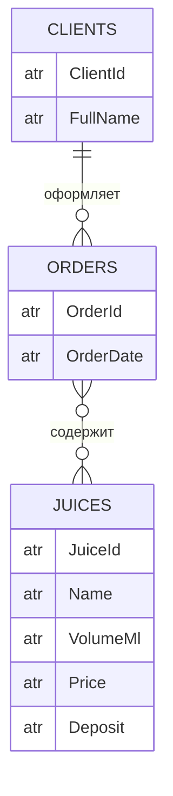
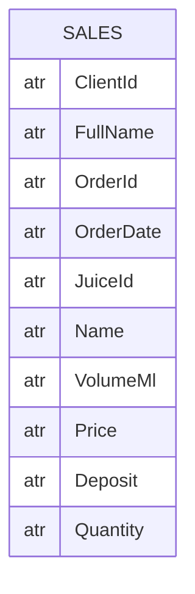
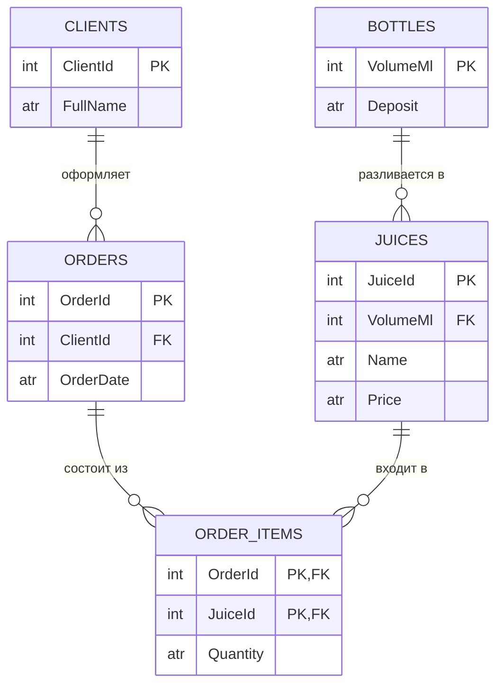

# Лабораторная работа №1

**Предметная область:** продажа сока в стеклянной таре

**Цель работы:** приобретение навыков анализа предметной области и построения концептуальной модели.

**Содержание работы:**

- анализ текстового описания предметной области;
- построение концептуальной модели.

**Задания:**

1. Выделить основные абстракции (сущность, атрибут, связь) в предметной области и определить их параметры.
2. Сформировать максимально полный перечень возможных запросов к базе данных на основе анализа предметной области.
3. Построить концептуальную модель в виде ER-диаграммы.
4. Представить концептуальную модель в терминах реляционной модели.
5. Описать домены (допустимые множества значений, которые могут принимать атрибуты), указывая типы соответствующих данных и их характеристики.
6. Определить ключи и внешние ключи (если они есть).
7. Выписать функциональные зависимости (рассматривая возможные значения полей таблицы).
8. Привести полученную концептуальную модель к третьей нормальной форме (показать, что она находится в соответствующей нормальной форме).

---

## Описание предметной области

Компания продаёт соки в стеклянных бутылках. Каждый сок (например, яблочный или апельсиновый) разливается в бутылки определённого объёма и имеет свою цену. Стеклянная тара возвратная: при покупке за каждую бутылку берётся залог, размер которого зависит от объёма бутылки.

Клиенты оформляют заказы. В один заказ может входить несколько разных соков в разном количестве.

---

## Выполнение работы

### 1. Выделить основные абстракции (сущность, атрибут, связь) в предметной области и определить их параметры

Определим следующие сущности: **КЛИЕНТ**, **ЗАКАЗ**, **СОК**.

Определим атрибуты сущностей. Пусть для упрощения сущность КЛИЕНТ характеризуется только ФИО. Так как ФИО может неоднозначно идентифицировать объект (возможны однофамильцы), введём дополнительный атрибут «код клиента», уникальный для каждого клиента. Итак, КЛИЕНТ: код клиента, ФИО.

Аналогично определим сущность ЗАКАЗ с атрибутами: номер заказа, дата заказа.

Сущность СОК описывает товарную позицию: сок определённого названия в бутылке определённого объёма. Яблочный сок в бутылках 0,2 л и 1 л — это разные позиции с разной ценой, поэтому вводим «код сока». СОК: код сока, название, объём тары, цена, залог за бутылку.

Между сущностями существуют связи:

- клиент оформляет заказ — связь 1:N (у клиента много заказов, у заказа один клиент);
- заказ содержит сок — связь M:N (в заказе несколько соков, один сок бывает в разных заказах). У этой связи есть своя характеристика — количество купленных бутылок.

**Упрощения:** цена сока считается неизменной; залог определяется объёмом бутылки; возврат тары не учитывается.

### 2. Сформировать максимально полный перечень возможных запросов к базе данных

По смыслу задачи возможны следующие запросы:

1. Какие заказы оформил клиент с заданной фамилией (кодом)?
2. Какие соки и в каком количестве входят в заказ с заданным номером?
3. Какова стоимость заказа с заданным номером и какова сумма залога за тару в нём?
4. Какие клиенты заказывали сок с заданным названием?
5. Какие соки разлиты в тару заданного объёма и какова их цена?
6. Каков залог за бутылку заданного объёма?
7. Сколько бутылок сока с заданным названием продано за заданный период?
8. Какие заказы оформлены на заданную дату?

В данном примере остановимся на этих запросах.

### 3. Построить концептуальную модель в виде ER-диаграммы

По этой диаграмме можно ответить на запросы 1, 4, 5, 6 и 8. На запросы 2, 3 и 7 ответить нельзя: количество бутылок — это характеристика не заказа и не сока, а пары «заказ — сок». Введем новую агрегированную сущность. Определим её как **ПРОДАЖА** (позиция заказа), объединив в ней все атрибуты. Нарисуем второй вариант ER-диаграммы.

По этой диаграмме можно ответить на все запросы, но здесь очевидно дублирование информации и возможны аномалии добавления, удаления и обновления

### 4. Представить концептуальную модель в терминах реляционной модели

В терминах концептуальной модели вариант 2 представляется одним отношением **ПРОДАЖА**. Введём краткие обозначения атрибутов:

| Обозн. | Атрибут | Обозн. | Атрибут |
|--------|---------|--------|---------|
| КК | код клиента | ОБ | объём тары |
| ФИО | ФИО клиента | Ц | цена |
| НЗ | номер заказа | ЗЛ | залог за бутылку |
| ДЗ | дата заказа | КОЛ | количество бутылок |
| КС | код сока | НС | название сока |

**ПРОДАЖА**(КК, ФИО, **НЗ**, ДЗ, **КС**, НС, ОБ, Ц, ЗЛ, КОЛ)

Заполним отношение данными (фрагмент, показаны не все столбцы):

| НЗ  | ФИО      | КС | НС           | ОБ   | ЗЛ   | КОЛ |
|-----|----------|----|--------------|------|------|-----|
| 101 | Иванов   | 1  | Яблочный     | 200  | 0,20 | 24  |
| 101 | Иванов   | 3  | Апельсиновый | 1000 | 0,50 | 6   |
| 102 | Петров   | 1  | Яблочный     | 200  | 0,20 | 12  |
| 102 | Петров   | 2  | Яблочный     | 1000 | 0,50 | 3   |
| 103 | Сидорова | 3  | Апельсиновый | 1000 | 0,50 | 10  |

Данные дублируются: ФИО клиента повторяется в каждой позиции его заказа, а название сока, объём и залог — в каждой строке с этим соком. Отсюда аномалии:

- **добавления** — нельзя внести новый сок или клиента, пока нет заказа;
- **удаления** — при удалении единственного заказа с соком «Апельсиновый» теряются сведения об этом соке и его цене;
- **обновления** — при смене залога за бутылку 1000 мл его нужно менять во всех строках, иначе данные станут противоречивыми.

### 5. Описать домены

| Атрибут | Тип данных | Область значений и характеристики |
|---------|------------|-----------------------------------|
| Код клиента (КК) | целое | целые числа, максимальная длина 4 знака |
| ФИО (ФИО) | символьное | максимальная длина 40 символов |
| Номер заказа (НЗ) | целое | целые числа, максимальная длина 6 знаков |
| Дата заказа (ДЗ) | дата | формат ДД.ММ.ГГГГ |
| Код сока (КС) | целое | целые числа, максимальная длина 4 знака |
| Название сока (НС) | символьное | максимальная длина 20 символов |
| Объём тары (ОБ) | целое | объём в мл: 200, 330, 500 или 1000 |
| Цена (Ц) | вещественное | положительное число, до 4 знаков до запятой и 2 после, руб. |
| Залог (ЗЛ) | вещественное | неотрицательное число, до 2 знаков до запятой и 2 после, руб. за бутылку |
| Количество (КОЛ) | целое | целые числа от 1 до 999 |

### 6. Определить ключи и внешние ключи

Ключом отношения ПРОДАЖА является совокупность атрибутов (НЗ, КС). Внешних ключей в единственном отношении нет. Ключи итоговой модели приведены в п. 8.

### 7. Выписать функциональные зависимости

Функциональная зависимость описывает связь между атрибутами отношения. Если в отношении R атрибут B функционально зависит от атрибута A (A → B), то каждое значение A связано только с одним значением B.

Рассматривая возможные значения полей таблицы, выпишем зависимости:

1. **КК → ФИО** — у каждого клиента одно ФИО;
2. **НЗ → ДЗ, КК** — у заказа одна дата и один клиент;
3. **КС → НС, ОБ, Ц** — код сока определяет название, объём бутылки и цену;
4. **ОБ → ЗЛ** — залог определяется объёмом бутылки;
5. **(НЗ, КС) → КОЛ** — количество определяется парой «заказ — сок».

Зависимость НС → Ц не выполняется: яблочный сок в бутылках 0,2 л и 1 л стоит по-разному. Зависимость ФИО → КК тоже не выполняется из-за возможных однофамильцев.

Проверим, что (НЗ, КС) — ключ. По зависимости 2 получаем ДЗ и КК; по 1 — ФИО; по 3 — НС, ОБ, Ц; по 4 — ЗЛ; по 5 — КОЛ. Замыкание {НЗ, КС} содержит все 10 атрибутов.

### 8. Привести модель к третьей нормальной форме

*Нормализация* — это разбиение (декомпозиция) отношения на несколько с целью устранения дублирования данных. Цель — получить такой проект БД, в котором каждый факт хранится лишь в одном месте. Нормализация — процесс последовательный.

**1НФ.** Все значения атомарны: на пересечении любой строки и столбца находится одно значение. ПРОДАЖА находится в 1НФ.

**2НФ.** Отношение во 2НФ, если оно в 1НФ и каждый неключевой атрибут полностью зависит от всего ключа, а не от его части. В ПРОДАЖА ключ составной (НЗ, КС), но ДЗ, КК, ФИО зависят только от НЗ, а НС, ОБ, Ц, ЗЛ — только от КС. Значит, отношение не во 2НФ. Разобьём его по частям ключа:

- Т1(**НЗ**, ДЗ, КК, ФИО)
- Т2(**КС**, НС, ОБ, Ц, ЗЛ)
- Т3(**НЗ**, **КС**, КОЛ)

В Т1 и Т2 ключи простые, в Т3 КОЛ зависит от всего ключа, поэтому все три отношения во 2НФ.

**3НФ.** Отношение в 3НФ, если оно во 2НФ и ни один неключевой атрибут не зависит от другого неключевого (нет транзитивных зависимостей). В Т1 есть цепочка НЗ → КК → ФИО, в Т2 — цепочка КС → ОБ → ЗЛ. Вынесем их в отдельные отношения.

Исходное отношение приведено к пяти отношениям, каждое из которых находится в третьей нормальной форме:

- **R1 КЛИЕНТ**(**КК**, ФИО)
- **R2 ЗАКАЗ**(**НЗ**, ДЗ, КК)
- **R3 ТАРА**(**ОБ**, ЗЛ)
- **R4 СОК**(**КС**, НС, ОБ, Ц)
- **R5 СТРОКА ЗАКАЗА**(**НЗ**, **КС**, КОЛ)

Ключи и внешние ключи:

| Отношение | Первичный ключ | Внешние ключи |
|-----------|----------------|---------------|
| R1 КЛИЕНТ | КК | — |
| R2 ЗАКАЗ | НЗ | КК → R1 |
| R3 ТАРА | ОБ | — |
| R4 СОК | КС | ОБ → R3 |
| R5 СТРОКА ЗАКАЗА | (НЗ, КС) — составной | НЗ → R2; КС → R4 |

Везде единственные детерминанты — первичные ключи, поэтому отношения находятся и в нормальной форме Бойса — Кодда.

Для наглядности представим полученную модель в виде ER-диаграммы.

Таким образом, полученная реляционная модель включает пять отношений.