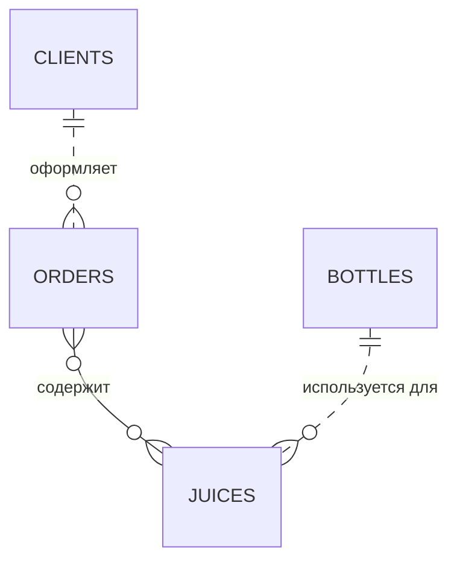
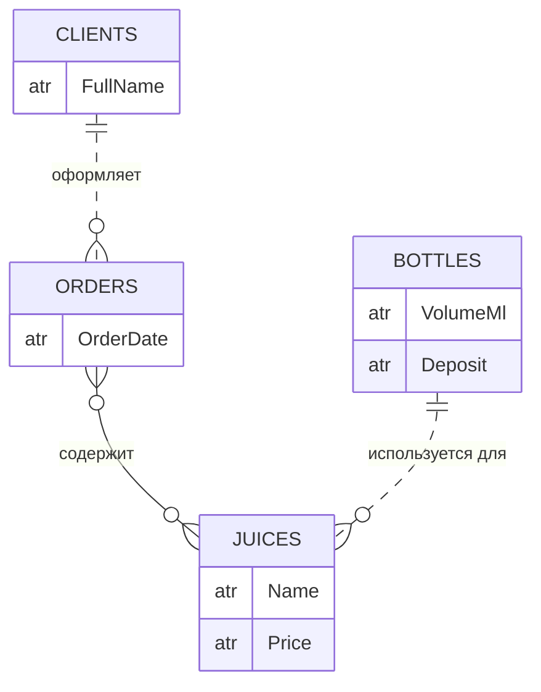
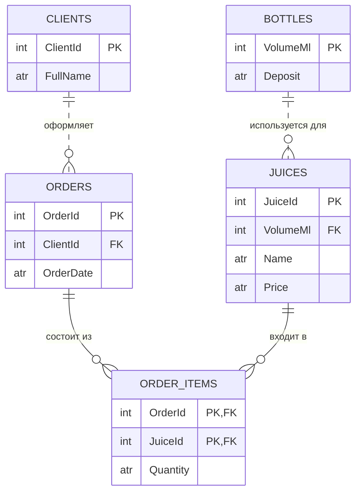
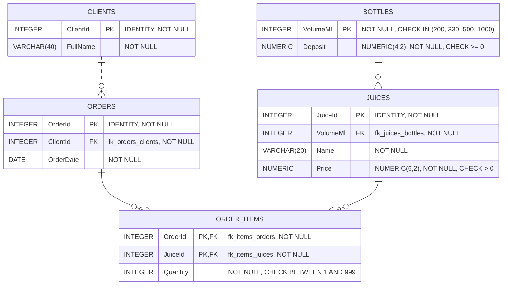

# Лабораторная работа №2

**Проектирование схемы базы данных**

**Предметная область:** продажа сока в стеклянной таре

**Цель работы:** получить практические навыки проектирования базы данных: построить инфологическую, даталогическую и физическую модели. Диаграммы описаны в нотации Mermaid.

## 1. Результаты анализа предметной области

Существует компании, которая продаёт соки в стеклянных бутылках. Стеклянная тара возвратная: за каждую бутылку при покупке берётся залог, размер которого зависит от объёма бутылки.

По результатам бизнес-анализа выявлены следующие сущности:

| Сущность | Имя на диаграммах | Описание |
|----------|-------------------|----------|
| Клиенты | `CLIENTS` | Покупатели, которые оформляют заказы. Атрибут — ФИО клиента. |
| Заказы | `ORDERS` | Заказы, сделанные клиентами. Атрибут — дата заказа. |
| Соки | `JUICES` | Товарные позиции, предлагаемые на продажу. Атрибуты — название сока и цена. |
| Тара | `BOTTLES` | Типы стеклянных бутылок. Атрибуты — объём тары и залог за бутылку. |

Выявлены следующие отношения между сущностями:

| Отношение | Описание |
|-----------|----------|
| Клиенты — Заказы | Каждый клиент может сделать много заказов, один заказ принадлежит только одному клиенту. |
| Заказы — Соки | Каждый заказ состоит из многих соков, каждый сок может входить в разные заказы. |
| Тара — Соки | Один тип бутылки используется для многих соков, каждый сок разливается в бутылку одного типа. |

---

## 2. Инфологическая модель: сущности и связи

На первом этапе определяются сущности предметной области и зависимости между ними.

Связи «Клиенты — Заказы» и «Тара — Соки» неидентифицирующие, причём обязательные: заказ не может существовать без клиента, а сок — без типа бутылки. Связь «Заказы — Соки» имеет тип «многие-ко-многим».

*Рис. 1. Инфологическая модель на уровне сущностей и связей*

---

## 3. Инфологическая модель с атрибутами

Инфологическая модель дополнена атрибутами, характеризующими объекты предметной области.

*Рис. 2. Инфологическая модель на уровне сущностей, связей и атрибутов*

---

## 4. Даталогическая модель

На этапе построения даталогической модели сущности преобразуются в таблицы, а атрибуты в поля таблиц. Для каждой таблицы определяется первичный ключ, а связи реализуются с помощью внешних ключей.

- В таблицах «Клиенты», «Заказы» и «Соки» введены дополнительные поля-идентификаторы `ClientId`, `OrderId` и `JuiceId`, которые становятся первичными ключами.
- Первичным ключом таблицы «Тара» является объём бутылки `VolumeMl`: залог однозначно определяется объёмом.
- В дочерних таблицах внешние ключи (`ClientId` в `ORDERS`, `VolumeMl` в `JUICES`) создаются автоматически при построении связей.
- Связь «многие-ко-многим» между «Заказами» и «Соками» заменена двумя связями «один-ко-многим» с помощью ассоциативной таблицы `ORDER_ITEMS` (состав заказа). Её поля `OrderId` и `JuiceId` одновременно являются внешними ключами и образуют составной первичный ключ. В таблицу добавлено поле `Quantity` — количество купленных бутылок.

*Рис. 3. Даталогическая модель на уровне полей*

Полученная схема находится в третьей нормальной форме (см. лабораторную работу №1).

---

## 5. Физическая модель базы данных

На заключительном этапе для всех полей определяются типы данных целевой СУБД PostgreSQL, а также параметры `NULL`/`NOT NULL`, ограничения значений и имена внешних ключей (они указаны на связях). Типы и допустимые значения соответствуют доменам из лабораторной работы №1.

