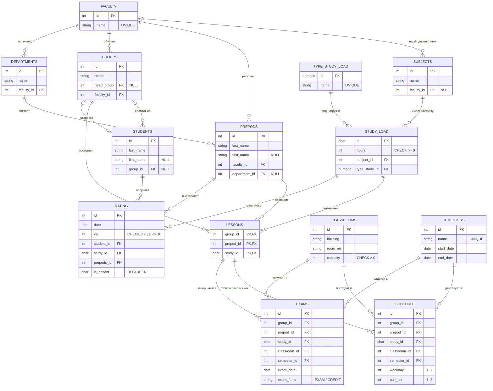
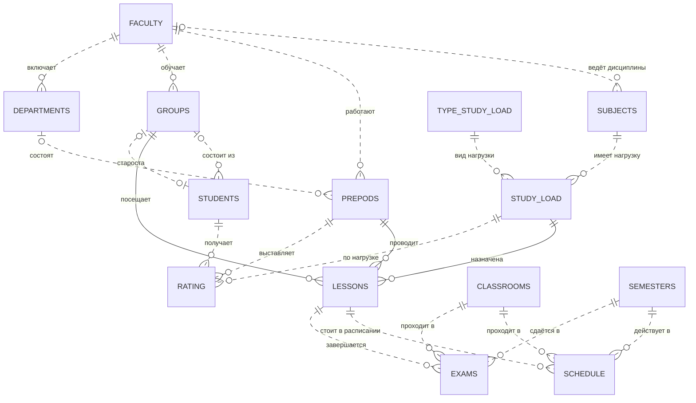
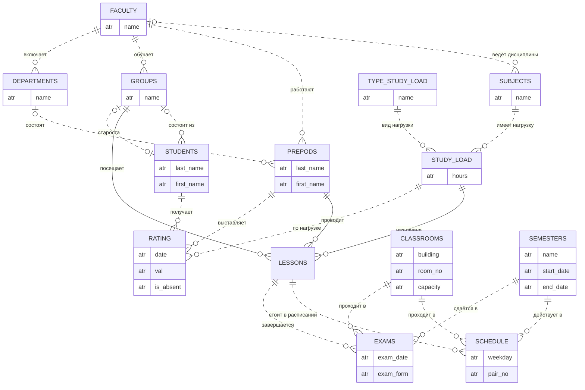
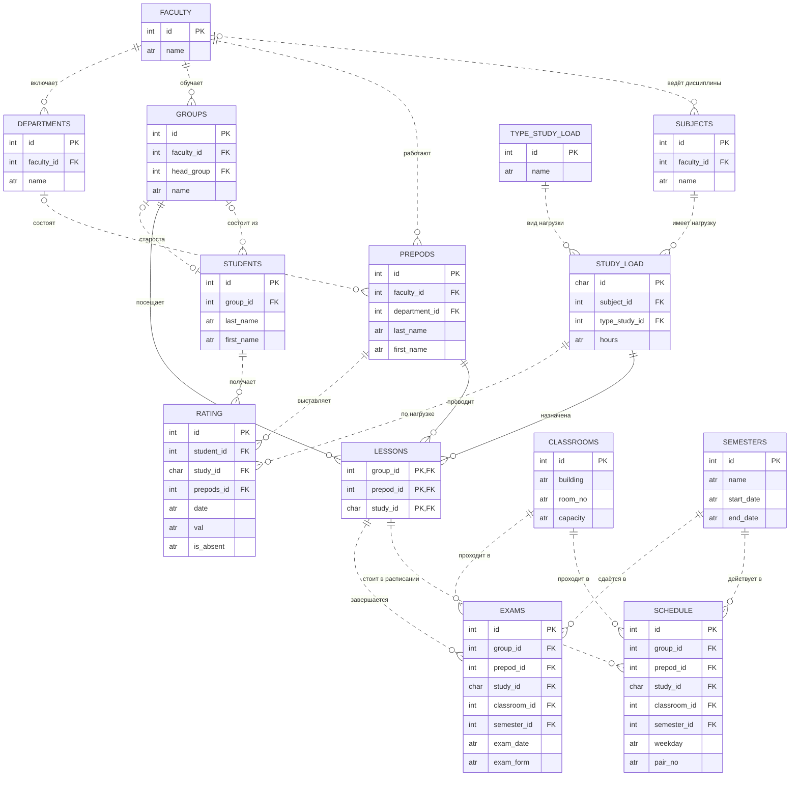
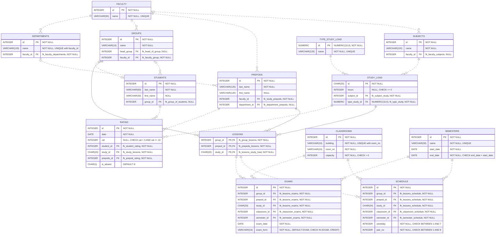

# ER-диаграмма 

```mermaid
erDiagram
    FACULTY |o--o{ SUBJECTS : "ведёт дисциплины"
    FACULTY ||--o{ PREPODS : "работают"
    FACULTY ||--o{ GROUPS : "обучает"
    FACULTY ||--o{ DEPARTMENTS : "включает"
    DEPARTMENTS |o--o{ PREPODS : "состоят"
    SUBJECTS ||--o{ STUDY_LOAD : "имеет нагрузку"
    TYPE_STUDY_LOAD ||--o{ STUDY_LOAD : "вид нагрузки"
    GROUPS |o--o{ STUDENTS : "состоит из"
    STUDENTS |o--o| GROUPS : "староста"
    GROUPS ||--o{ LESSONS : "посещает"
    PREPODS ||--o{ LESSONS : "проводит"
    STUDY_LOAD ||--o{ LESSONS : "назначена"
    STUDENTS ||--o{ RATING : "получает"
    STUDY_LOAD ||--o{ RATING : "по нагрузке"
    PREPODS ||--o{ RATING : "выставляет"
    LESSONS ||--o{ SCHEDULE : "стоит в расписании"
    CLASSROOMS ||--o{ SCHEDULE : "проходит в"
    SEMESTERS ||--o{ SCHEDULE : "действует в"
    LESSONS ||--o{ EXAMS : "завершается"
    CLASSROOMS ||--o{ EXAMS : "проходит в"
    SEMESTERS ||--o{ EXAMS : "сдаётся в"
 
    FACULTY {
        int id PK
        string name "UNIQUE"
    }
 
    TYPE_STUDY_LOAD {
        numeric id PK
        string name "UNIQUE"
    }
 
    SUBJECTS {
        int id PK
        string name
        int faculty_id FK "NULL"
    }
 
    DEPARTMENTS {
        int id PK
        string name
        int faculty_id FK
    }
 
    PREPODS {
        int id PK
        string last_name
        string first_name "NULL"
        int faculty_id FK
        int department_id FK "NULL"
    }
 
    STUDY_LOAD {
        char id PK
        int hours "CHECK >= 0"
        int subject_id FK
        numeric type_study_id FK
    }
 
    GROUPS {
        int id PK
        string name
        int head_group FK "NULL"
        int faculty_id FK
    }
 
    STUDENTS {
        int id PK
        string last_name
        string first_name "NULL"
        int group_id FK "NULL"
    }
 
    LESSONS {
        int group_id PK, FK
        int prepod_id PK, FK
        char study_id PK, FK
    }
 
    RATING {
        int id PK
        date date
        int val "CHECK 3 < val <= 10"
        int student_id FK
        char study_id FK
        int prepods_id FK
        char is_absent "DEFAULT N"
    }
 
    CLASSROOMS {
        int id PK
        string building
        string room_no
        int capacity "CHECK > 0"
    }
 
    SEMESTERS {
        int id PK
        string name "UNIQUE"
        date start_date
        date end_date
    }
 
    SCHEDULE {
        int id PK
        int group_id FK
        int prepod_id FK
        char study_id FK
        int classroom_id FK
        int semester_id FK
        int weekday "1..7"
        int pair_no "1..8"
    }
 
    EXAMS {
        int id PK
        int group_id FK
        int prepod_id FK
        char study_id FK
        int classroom_id FK
        int semester_id FK
        date exam_date
        string exam_form "EXAM / CREDIT"
    }
```

# Инфологическая модель: сущности и связи

```mermaid
erDiagram
    FACULTY |o..o{ SUBJECTS : "ведёт дисциплины"
    FACULTY ||..o{ PREPODS : "работают"
    FACULTY ||..o{ GROUPS : "обучает"
    FACULTY ||..o{ DEPARTMENTS : "включает"
    DEPARTMENTS |o..o{ PREPODS : "состоят"
    SUBJECTS ||..o{ STUDY_LOAD : "имеет нагрузку"
    TYPE_STUDY_LOAD ||..o{ STUDY_LOAD : "вид нагрузки"
    GROUPS |o..o{ STUDENTS : "состоит из"
    STUDENTS |o..o| GROUPS : "староста"
    GROUPS ||--o{ LESSONS : "посещает"
    PREPODS ||--o{ LESSONS : "проводит"
    STUDY_LOAD ||--o{ LESSONS : "назначена"
    STUDENTS ||..o{ RATING : "получает"
    STUDY_LOAD ||..o{ RATING : "по нагрузке"
    PREPODS ||..o{ RATING : "выставляет"
    LESSONS ||..o{ SCHEDULE : "стоит в расписании"
    CLASSROOMS ||..o{ SCHEDULE : "проходит в"
    SEMESTERS ||..o{ SCHEDULE : "действует в"
    LESSONS ||..o{ EXAMS : "завершается"
    CLASSROOMS ||..o{ EXAMS : "проходит в"
    SEMESTERS ||..o{ EXAMS : "сдаётся в"
```

# Инфологическая модель с атрибутами

```mermaid
erDiagram
    FACULTY |o..o{ SUBJECTS : "ведёт дисциплины"
    FACULTY ||..o{ PREPODS : "работают"
    FACULTY ||..o{ GROUPS : "обучает"
    FACULTY ||..o{ DEPARTMENTS : "включает"
    DEPARTMENTS |o..o{ PREPODS : "состоят"
    SUBJECTS ||..o{ STUDY_LOAD : "имеет нагрузку"
    TYPE_STUDY_LOAD ||..o{ STUDY_LOAD : "вид нагрузки"
    GROUPS |o..o{ STUDENTS : "состоит из"
    STUDENTS |o..o| GROUPS : "староста"
    GROUPS ||--o{ LESSONS : "посещает"
    PREPODS ||--o{ LESSONS : "проводит"
    STUDY_LOAD ||--o{ LESSONS : "назначена"
    STUDENTS ||..o{ RATING : "получает"
    STUDY_LOAD ||..o{ RATING : "по нагрузке"
    PREPODS ||..o{ RATING : "выставляет"
    LESSONS ||..o{ SCHEDULE : "стоит в расписании"
    CLASSROOMS ||..o{ SCHEDULE : "проходит в"
    SEMESTERS ||..o{ SCHEDULE : "действует в"
    LESSONS ||..o{ EXAMS : "завершается"
    CLASSROOMS ||..o{ EXAMS : "проходит в"
    SEMESTERS ||..o{ EXAMS : "сдаётся в"
 
    FACULTY {
        atr name
    }
 
    DEPARTMENTS {
        atr name
    }
 
    PREPODS {
        atr last_name
        atr first_name
    }
 
    GROUPS {
        atr name
    }
 
    STUDENTS {
        atr last_name
        atr first_name
    }
 
    SUBJECTS {
        atr name
    }
 
    TYPE_STUDY_LOAD {
        atr name
    }
 
    STUDY_LOAD {
        atr hours
    }
 
    RATING {
        atr date
        atr val
        atr is_absent
    }
 
    CLASSROOMS {
        atr building
        atr room_no
        atr capacity
    }
 
    SEMESTERS {
        atr name
        atr start_date
        atr end_date
    }
 
    SCHEDULE {
        atr weekday
        atr pair_no
    }
 
    EXAMS {
        atr exam_date
        atr exam_form
    }
```

# Даталогическая модель

```mermaid
erDiagram
    FACULTY |o..o{ SUBJECTS : "ведёт дисциплины"
    FACULTY ||..o{ PREPODS : "работают"
    FACULTY ||..o{ GROUPS : "обучает"
    FACULTY ||..o{ DEPARTMENTS : "включает"
    DEPARTMENTS |o..o{ PREPODS : "состоят"
    SUBJECTS ||..o{ STUDY_LOAD : "имеет нагрузку"
    TYPE_STUDY_LOAD ||..o{ STUDY_LOAD : "вид нагрузки"
    GROUPS |o..o{ STUDENTS : "состоит из"
    STUDENTS |o..o| GROUPS : "староста"
    GROUPS ||--o{ LESSONS : "посещает"
    PREPODS ||--o{ LESSONS : "проводит"
    STUDY_LOAD ||--o{ LESSONS : "назначена"
    STUDENTS ||..o{ RATING : "получает"
    STUDY_LOAD ||..o{ RATING : "по нагрузке"
    PREPODS ||..o{ RATING : "выставляет"
    LESSONS ||..o{ SCHEDULE : "стоит в расписании"
    CLASSROOMS ||..o{ SCHEDULE : "проходит в"
    SEMESTERS ||..o{ SCHEDULE : "действует в"
    LESSONS ||..o{ EXAMS : "завершается"
    CLASSROOMS ||..o{ EXAMS : "проходит в"
    SEMESTERS ||..o{ EXAMS : "сдаётся в"
 
    FACULTY {
        int id PK
        atr name
    }
 
    DEPARTMENTS {
        int id PK
        int faculty_id FK
        atr name
    }
 
    PREPODS {
        int id PK
        int faculty_id FK
        int department_id FK
        atr last_name
        atr first_name
    }
 
    GROUPS {
        int id PK
        int faculty_id FK
        int head_group FK
        atr name
    }
 
    STUDENTS {
        int id PK
        int group_id FK
        atr last_name
        atr first_name
    }
 
    SUBJECTS {
        int id PK
        int faculty_id FK
        atr name
    }
 
    TYPE_STUDY_LOAD {
        int id PK
        atr name
    }
 
    STUDY_LOAD {
        char id PK
        int subject_id FK
        int type_study_id FK
        atr hours
    }
 
    LESSONS {
        int group_id PK, FK
        int prepod_id PK, FK
        char study_id PK, FK
    }
 
    RATING {
        int id PK
        int student_id FK
        char study_id FK
        int prepods_id FK
        atr date
        atr val
        atr is_absent
    }
 
    CLASSROOMS {
        int id PK
        atr building
        atr room_no
        atr capacity
    }
 
    SEMESTERS {
        int id PK
        atr name
        atr start_date
        atr end_date
    }
 
    SCHEDULE {
        int id PK
        int group_id FK
        int prepod_id FK
        char study_id FK
        int classroom_id FK
        int semester_id FK
        atr weekday
        atr pair_no
    }
 
    EXAMS {
        int id PK
        int group_id FK
        int prepod_id FK
        char study_id FK
        int classroom_id FK
        int semester_id FK
        atr exam_date
        atr exam_form
    }
```

# Физическая модель базы данных

```mermaid
erDiagram
    FACULTY |o..o{ SUBJECTS : ""
    FACULTY ||..o{ PREPODS : ""
    FACULTY ||..o{ GROUPS : ""
    FACULTY ||..o{ DEPARTMENTS : ""
    DEPARTMENTS |o..o{ PREPODS : ""
    SUBJECTS ||..o{ STUDY_LOAD : ""
    TYPE_STUDY_LOAD ||..o{ STUDY_LOAD : ""
    GROUPS |o..o{ STUDENTS : ""
    STUDENTS |o..o| GROUPS : ""
    GROUPS ||--o{ LESSONS : ""
    PREPODS ||--o{ LESSONS : ""
    STUDY_LOAD ||--o{ LESSONS : ""
    STUDENTS ||..o{ RATING : ""
    STUDY_LOAD ||..o{ RATING : ""
    PREPODS ||..o{ RATING : ""
    LESSONS ||..o{ SCHEDULE : ""
    CLASSROOMS ||..o{ SCHEDULE : ""
    SEMESTERS ||..o{ SCHEDULE : ""
    LESSONS ||..o{ EXAMS : ""
    CLASSROOMS ||..o{ EXAMS : ""
    SEMESTERS ||..o{ EXAMS : ""
 
    FACULTY {
        INTEGER id PK "NOT NULL"
        VARCHAR(30) name "NOT NULL, UNIQUE"
    }
 
    DEPARTMENTS {
        INTEGER id PK "NOT NULL"
        VARCHAR(120) name "NOT NULL, UNIQUE with faculty_id"
        INTEGER faculty_id FK "fk_faculty_departments, NOT NULL"
    }
 
    PREPODS {
        INTEGER id PK "NOT NULL"
        VARCHAR(120) last_name "NOT NULL"
        VARCHAR(120) first_name "NULL"
        INTEGER faculty_id FK "fk_study_prepods, NOT NULL"
        INTEGER department_id FK "fk_department_prepods, NULL"
    }
 
    GROUPS {
        INTEGER id PK "NOT NULL"
        VARCHAR(10) name "NOT NULL"
        INTEGER head_group FK "fk_head_of_group, NULL"
        INTEGER faculty_id FK "fk_faculty_group, NOT NULL"
    }
 
    STUDENTS {
        INTEGER id PK "NOT NULL"
        VARCHAR(60) last_name "NOT NULL"
        VARCHAR(30) first_name "NULL"
        INTEGER group_id FK "fk_group_of_students, NULL"
    }
 
    SUBJECTS {
        INTEGER id PK "NOT NULL"
        VARCHAR(120) name "NOT NULL"
        INTEGER faculty_id FK "fk_faculty_subjects, NULL"
    }
 
    TYPE_STUDY_LOAD {
        NUMERIC id PK "NUMERIC(10,0), NOT NULL"
        VARCHAR(120) name "NOT NULL, UNIQUE"
    }
 
    STUDY_LOAD {
        CHAR(20) id PK "NOT NULL"
        INTEGER hours "NULL, CHECK >= 0"
        INTEGER subject_id FK "fk_subject_study, NOT NULL"
        NUMERIC type_study_id FK "NUMERIC(10,0), fk_type_study, NOT NULL"
    }
 
    LESSONS {
        INTEGER group_id PK, FK "fk_group_lessons, NOT NULL"
        INTEGER prepod_id PK, FK "fk_prepods_lessons, NOT NULL"
        CHAR(20) study_id PK, FK "fk_lessons_study_load, NOT NULL"
    }
 
    RATING {
        INTEGER id PK "NOT NULL"
        DATE date "NOT NULL"
        INTEGER val "NULL, CHECK val > 3 AND val <= 10"
        INTEGER student_id FK "fk_student_rating, NOT NULL"
        CHAR(20) study_id FK "fk_study_lessons, NOT NULL"
        INTEGER prepods_id FK "fk_prepod_rating, NOT NULL"
        CHAR(1) is_absent "DEFAULT N"
    }
 
    CLASSROOMS {
        INTEGER id PK "NOT NULL"
        VARCHAR(10) building "NOT NULL, UNIQUE with room_no"
        VARCHAR(10) room_no "NOT NULL"
        INTEGER capacity "NOT NULL, CHECK > 0"
    }
 
    SEMESTERS {
        INTEGER id PK "NOT NULL"
        VARCHAR(30) name "NOT NULL, UNIQUE"
        DATE start_date "NOT NULL"
        DATE end_date "NOT NULL, CHECK end_date > start_date"
    }
 
    SCHEDULE {
        INTEGER id PK "NOT NULL"
        INTEGER group_id FK "fk_lessons_schedule, NOT NULL"
        INTEGER prepod_id FK "fk_lessons_schedule, NOT NULL"
        CHAR(20) study_id FK "fk_lessons_schedule, NOT NULL"
        INTEGER classroom_id FK "fk_classroom_schedule, NOT NULL"
        INTEGER semester_id FK "fk_semester_schedule, NOT NULL"
        INTEGER weekday "NOT NULL, CHECK BETWEEN 1 AND 7"
        INTEGER pair_no "NOT NULL, CHECK BETWEEN 1 AND 8"
    }
 
    EXAMS {
        INTEGER id PK "NOT NULL"
        INTEGER group_id FK "fk_lessons_exams, NOT NULL"
        INTEGER prepod_id FK "fk_lessons_exams, NOT NULL"
        CHAR(20) study_id FK "fk_lessons_exams, NOT NULL"
        INTEGER classroom_id FK "fk_classroom_exams, NOT NULL"
        INTEGER semester_id FK "fk_semester_exams, NOT NULL"
        DATE exam_date "NOT NULL"
        VARCHAR(10) exam_form "NOT NULL, DEFAULT EXAM, CHECK IN (EXAM, CREDIT)"
    }
```
 